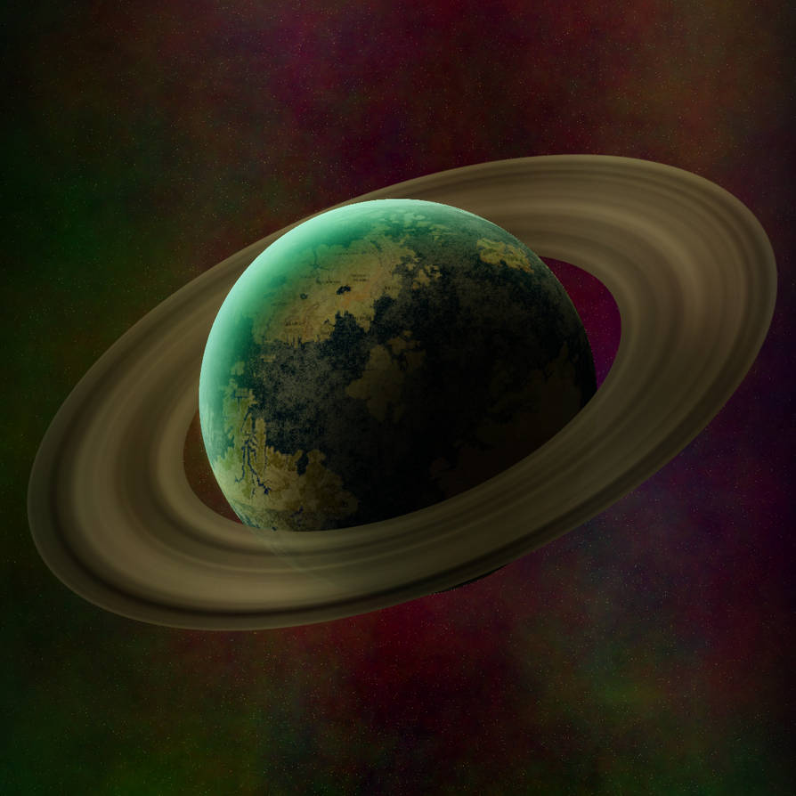

So I mentioned this plan to Anna and Chorley and now we've all run away with it, but I thought I'd
take this time to write in a quick disclaimer: _this will be basically my first time DMing, so I'm keeping
worldbuilding shortish for the moment_.

Below is the general background to the world we'll be doing this in, we can flesh this out more as we go. I'm going to
try and plan for session 01 this week, but if my free time gets soaked up then we may have to postpone until I'm ready.

I hope you guys are all still interested, but this is a strictly 0 commitment endeavor - no hard feelings if people can't spare the time, I'm not even sure I'll have enough as it is ;)

Anyway, without further adeu:

## Eberron

This is Eberron, where everything happens unless we leave the prime material for _antoher_ plane. Check this cool
excerpt from the sourcebook that tells us how this world was made:

> Our world was born in strife.
> The three progenitor dragons - Khyber, Siberys and Eberron - crafted the planes at the dawn of time,
> and rested in the space that lies between them. It was then that cruel Khyber turned on his siblings,
> killing noble Siberys and scattering the pieces of his body. Eberron fought Khyber, but couldn't defeat the
> dark wyrm. And so, Eberron wound Khyber in her coils and transformed, becoming a living prison that could
> forever hold the darkness within. And this is the foundation of our reality, Eberron is the Dragon Between,
> the ground upon which we stand. Khyber is the Dragon Below, source of demons and foul things. And the ring around our world is
> the broken body of Siberys, the Dragon Above, whose blood is the source of all magic.

_Pretty Cool Eh?_

So now you know that you're all gonna be doing this on the body of some god dragons, I'd better show you the continent you'll be on for now.

Also one thing to add, I'm bringing in the [planes from The Forgotten Realms](https://i.pinimg.com/originals/d1/20/1e/d1201e65bbd6440f0e1c130ef61e188d.jpg) - so the Feywild, Shadowfell, Elemental Planes of Fire, Water, Earth and so on are all still going concerns. We even have the Nine Hells!

## Khorviare

Eberron is the name of the world, but Khorvaire is the name of the continent (sorry Anna and Chorley).
See below this dope map I stole from a D&D wiki.

There are some _really_ big shake ups that have happened in Khorvaire in the last 100 years that you'll all definitely know about. Here's the immediate history of the land, and some of its major countries and organizations that even idiots have heard of:

#### The Last War

Khorvaire has just emerged from a century-long civil war, and the scars of that bitter conflict still remain. For hundreds of years the continent of Khorvaire was united under the Kingdom of Galifar. This came to an end with the death of the then King just over a century ago. Conflict over the succession spiraled into outright war between the Five Nations. The Last War was a bitter struggle that forever changed the shape of Khorvaire.

It was a century marked by shifting alliances, with years of stalemate interspersed with periods of intense conflict. This grueling conflict left scars on the land and the people, but there was worse to come. Two years before the end of the Last war, the nation of Cyre was consumed in a magical cataclysm now known as the Mourning. The cause of the Mourning remains unknown, and many fear that it was a consequence of the extensive use of war magic.

Shock and fear brought the nations to the negotiating table, and the Last War came to an end with the Treaty of Centire. While many celebrated the end of the war, others remain unsatisfied with its outcome. No one won the war, and the deep scars remain. War-torn villages and towns are still rebuilding. Once fertile farmlands are scorched and ruined. There are refugees in every major city. And even though people optimistically refer to it as the last war, most believe that it’s only a matter of time until it begins anew.

The mystery of the Mourning is the only thing holding the warmongers at bay. If the secret of the Mourning can be uncovered—if it can be proven that the Mourning couldn’t happen again, or if its power could be harnessed as a weapon—the Last War could begin again. As such, the nations remain in a cold war as each makes preparations and seeks advantages in the conflict that could lie ahead.

#### The **Five Nations**

Aundair, Breland, Cyre, Karrnath and Thrane are collectively referred
to as the Five Nations. These nations formed the
heart of the Kingdom of Galifar, and while each
has a unique cultural identity they are built on
this shared foundation.

| Name     | Capital            |                                                                           Noted For |
| :------- | :----------------- | ----------------------------------------------------------------------------------: |
| Aundair  | Fairhaven          |                              Arcane magic, cheese, education, fashion, grains, wine |
| Breland  | Wroat              | Industry, manufactured goods, metalwork, processed ore; organized crime, subterfuge |
| Cyre     | Metrol (destroyed) |                  Artifice, art, jewlery, music, philosophy, creativity, versatility |
| Karrnath | Korth              |   Ale, dairy, glass, livestock, lumber, paper, textiles; undead, martial discipline |
| Thrane   | Flamekeep          |       Divine magic, the Silver Flame, fine crafts, wool, textiles, fruit, livestock |

#### The **Twelve Houses**

The magical economy is dominated by a handful of powerful families and the guilds they maintain. These are the dragonmarked houses, barons of industry whose influence surpasses that of kings and queens. These dynastic houses derive their power from their dragonmarks: arcane sigils that are passed down through their bloodlines.

A dragonmark grants limited but useful magical abilities, and over the course of centuries the houses have used these powers to establish powerful monopolies. House Jorasco dominates the medical trade with its Mark of Healing, while only someone with House Lyrandar’s Mark of Storms can pilot an airship, for example.

These houses have expensive names meant for educated tongues, but most common folk refer to them by the _(animal that the houses' dragonmarks resemble)_.

The dragonmarked houses sold their services to all sides and made considerable profits from the war. The Five Nations are divided and dependent on the services of the houses, and its questionable if any one nation can impose its will upon them.

Outside the established influence of the twelve houses, the technology and infrastructure of the Five Kingdoms wanes rapidly. Towns and villages far from the mechanized cities the twelve holds sway over have little in terms of machinery, and resemble poor farming communities with little resources available. Inside the houses strongholds the reverse is true, and the tall steel buildings and flying airships that navigate smog filled streets resemble a [dystopian vision of the future](https://media1.tenor.com/images/1071ac1c02d0c33c5a62b2c570b72496/tenor.gif?itemid=3294338).

| Dragonmark  | House                | Race            |                                  Specialty |
| :---------- | :------------------- | :-------------- | -----------------------------------------: |
| Detection   | Medani _(dog)_       | Half-Elf        | Bodyguards, Investigation, Risk Management |
| Finding     | Tharashk _(tiger)_   | Human, Half-Orc | Bounty Hunting, Investigation, Prospecting |
| Handling    | Vadalis _(horse)_    | Human           |               Animal Training and Breeding |
| Healing     | Jorasco _(pig)_      | Halfling        |                                    Healing |
| Hospitality | Ghallanda _(rabbit)_ | Halfling        |           Food, Lodging, Urban Information |
| Making      | Cannith _(monkey)_   | Human           |                              Manufacturing |
| Passage     | Orien _(rat)_        | Human           |                        Land Transportation |
| Scribing    | Sivis _(rooster)_    | Gnome           |   Communication, Translation, Verification |
| Sentinel    | Deneith _(ox)_       | Human           |                    Bodyguards, Mercenaries |
| Shadow      | Phiarlan _(snake)_   | Elf             |                   Entertainment, Espionage |
|             | ???                  | ???             |               Entertainment, Assassination |
| Storm       | Lyrandar _(dragon)_  | Half-Elf        |                 Air and Sea Transportation |
| Warding     | Kundarak _(ram)_     | Dwarf           |                  Banking, Storage, Prisons |

Okay, that was fun! I've ripped all of this from the Eberron sourcebook, and this was mostly an exercise to get me going, **so nothing is set in stone** and of course, **you don't have to remember any of it**. But if you're still up for playing I hope theres enough stolen material here for you guys to flesh a character out.
