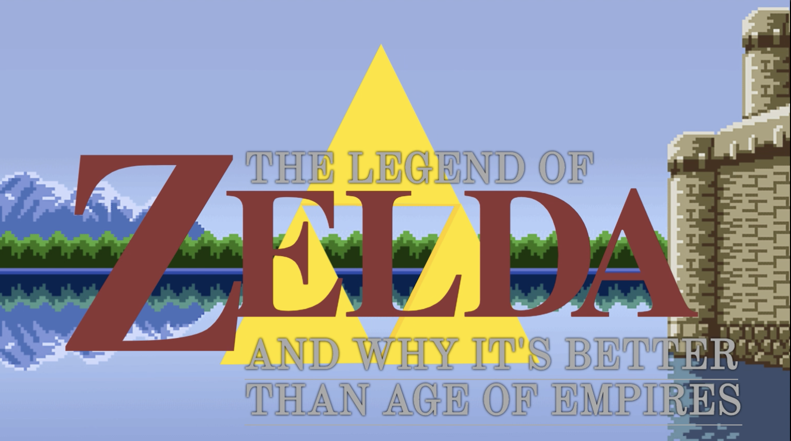
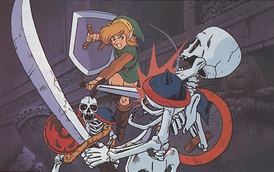
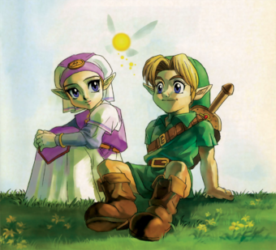
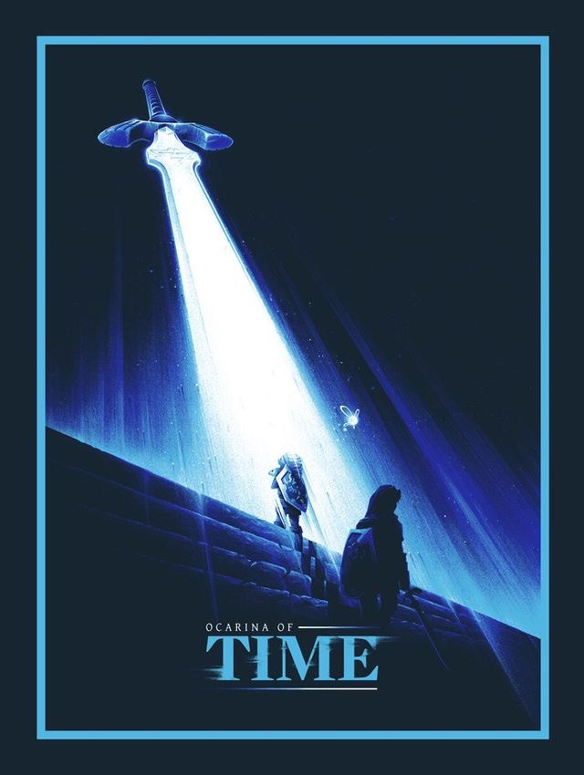
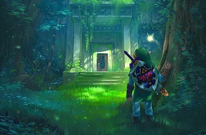
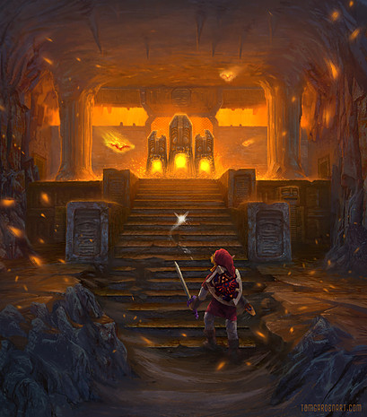
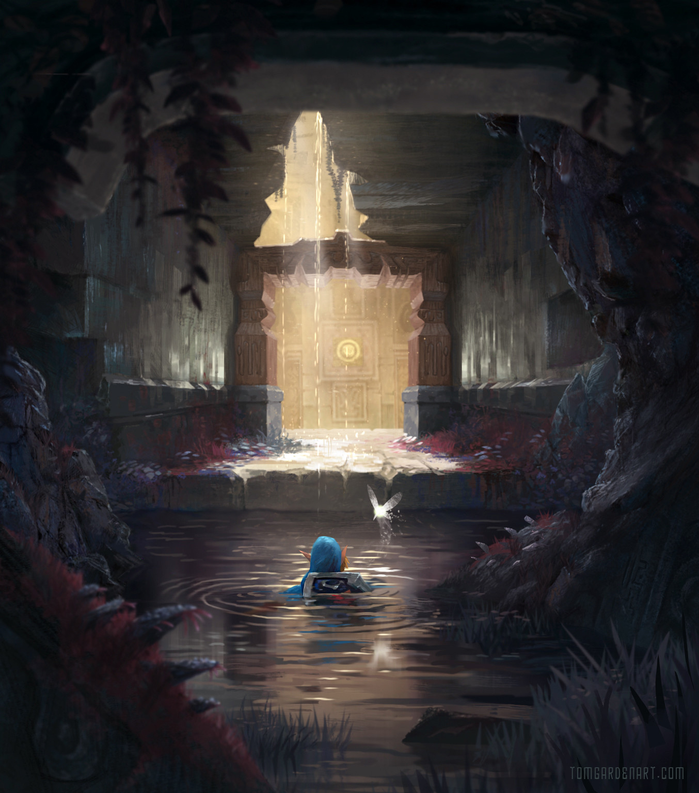
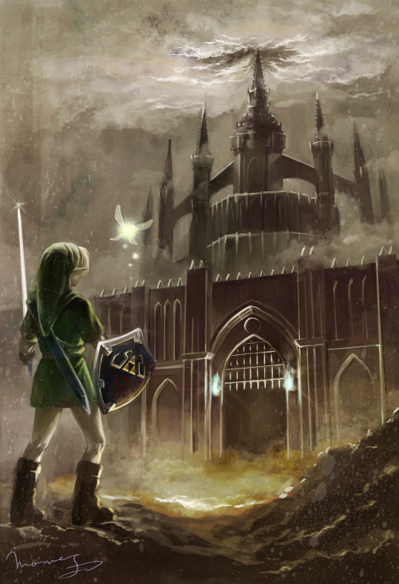

It's 1999 and I'm six years old. My sticky little fingers are wrapped around the light plastic of my N64 controller and I'm about to finally play a game that I've only ever been able to play at my older cousin's house. The game loads up and that's when I'm first hit with Koji Kondo's masterpiece soundtrack. 

`youtube: CtMllWsML5M`

You're immediately plunged into the game world, quickly establishing yourself as a member of a peter-pan style fairy community full of children who never grow older. Your great elder however - the Deku Tree - is quick to lay upon you a great burden: to lift the curse placed upon him and leave your paradise forest, taking up a great quest to aid the princess of Hyrule in the kingdom's protection. 

Unbeknownst to you, lifting the Deku Tree's curse will kill him and your friends will denounce you for your actions. You will never be able to return to Kokiri forest. You shall grow old, and eventually perish outside it.

How *the fuck* did they rate this **E for Everyone**???

`youtube: 9nOSs3rvPsI`

As you emerge into Hyrule Fields, Kondo's score pulls you out of your shocked state with an uplifting tune that compels you to explore the game's bright and cheerful land. It isn't until nightfall that the skeletons emerge, and hound you as you desperately wait for the drawbridge to Hyrule Market to lower at daybreak.

This is where the game really shows its strength. It's a marvel of managing atmosphere, at times appearing bleak and dangerous and at others feeling cozy and welcoming.

Much of the world in your childhood portion of the game is sunny and warm. Zora's domain and Goron City is teeming with colourful creatures while Hyrlue itself brims with cheerful shopkeepers and townsfolk.

In the immediate aftermath of Kokiri forest you're sent packing to find the titular Zelda, stowed safely away in a castle full of guards and protected by Impa, a badass ninja. Your main adversaries at this stage are just adults doing their job who won't hurt you, which does a great deal to make your adventures as a child seem very separate from what's to come. Child Link and child Zelda must maneuver around the King and his guard, even as they watch the malevolent influence of Ganondorf creep into the kingdom.

This subterfuge helps lower the stakes and turn down the intensity. It's easier to consider your task child's-play when you're sneaking around the grown-ups.

It's only after you're swallowed by a fish and after you've blown a giant lizard up with explosives that you're able to return to Zelda, ready and able to open up the secrets of the Temple of Time and use it's power to halt Ganondorf.

This is when, in my opinion, the most perfect thematic transition in a video game happens. You can tell something's wrong as you return across Hyrule field to find Zelda. The sky is growing dark and thunder streaks across it. In the pouring rain you see the drawbridge to Hyrule lower, and Zelda shoots across it on horseback, her ninja bodyguard Impa spiriting her away from Hyrule Castle.

She throws something in the river beside you, but before you can retrieve it you turn and come face to face with Ganondorf. His horse is enormous, black with red hair like its master. He peers imperiously down at you, the camera working to show you the difference in size between you two as Link cautiously draws his pathetically small sword. The sword of a child. 

`youtube: v3FSsNA78iI`

Not even bothering to dismount, Ganondorf blasts you across the screen before pursuing Zelda. Unable to help your friend, you're left to fish the item she threw in the river: the Ocarina of Time.

You enter the Temple of Time, as planned, without your ally. It's secret chamber opens for you and you're lead to one of the most well known videogame icons: the Master Sword.

Its here, in what was supposed to be your moment of triumph, that they execute the twist. Yes, you claim the Master Sword, the Sword of Sealing that you can use to banish Ganondorf away and save the realm. But claiming it extracts a price, as in order to have the strength to wield it you must *become an adult*.

This is where the children's story ends and the real story begins. Everything you've done up until now, in a very real sense, has been *child's-play*. Your actions haven't stopped Ganondorf, and in the years that passed as you magically aged *he won*. The kingdom belongs to him. Hyrule Castle is destroyed, replaced by a forboding tower. Goron Mountain now blazes like a funeral pyre. Zora lake is frozen solid, the great fish who swallowed you is absent. The Zora Domain and Goron City are both bereft of citizens, which is fortunate as the citizens of Hyrule have been transformed into moaning zombies whose screams can paralyze you as they feast on your flesh.

It's at this moment that you really feel the weight of your task upon you. It's this moment in the game that, for me, cements it as one of the greatest of all time. Having the balls to introduce you to a kids game, *as a kid*, and then push you out of that comfort zone by showing you *exactly* what happens when you fail, having the bad guy *win already*, and then asking you to push through a bleak and miserable world to save your friends completely blew my mind.

The story takes you from enchanted forests

to burning mountains. 

From the bottom of lakes

to stinging deserts, dank crypts and frozen caves before facing down your foe in a tower dark enough to make Stephen King wet himself.
  

Its weaves a typical hero's journey into a fable about growing up, taking responsibility, and having the courage to face evil even when all is already lost.

Its a great game that I always love to come back to every time it reinvents itself for a new generation.

It's my favorite, and I'll love it always.

